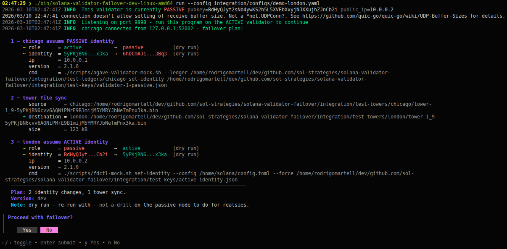
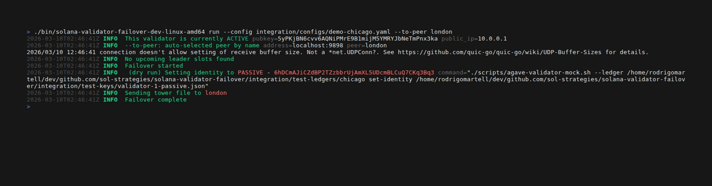

# solana-validator-failover

[](https://opensource.org/licenses/MIT)

Simple p2p Solana validator failovers. This tool helps automate **planned** failovers. To automate **unexpected** failovers see [solana-validator-ha](https://github.com/SOL-Strategies/solana-validator-ha).



A QUIC-based program that orchestrates safe, fast failovers between Solana validators. [This post](https://solstrategies.io/blog/quic-solana-validator-failovers) covers the background in more detail. In summary, it coordinates three steps across both nodes:

1. Active validator sets identity to passive
2. Alpenglow vote history transferred from active to passive validator
3. Passive validator sets identity to active

Convenience safety checks, bells, and whistles:

- Check and wait for validator health before failing over
- Wait for the estimated best slot time to failover
- Wait for no leader slots in the near future (if things go sideways — make it hurt a little less by not being leader 😬)
- Post-failover vote credit rank monitoring
- Pre/post failover hooks
- Customizable validator client and set identity commands to support (most) any validator client

## How it works

Running `solana-validator-failover run` on either node **automatically detects the node's role** (active or passive) from gossip and does the right thing:

- **Passive node** → starts a QUIC server, waits for the active node to connect
- **Active node** → connects to the passive peer as a QUIC client and orchestrates the handover

**You run the command on both nodes.** Start the passive node first so it is listening when the active node connects.




## Usage

```shell
# 1. Run on the passive node first — starts a server waiting for the active node
solana-validator-failover run --not-a-drill

# 2. Run on the active node — connects to the passive peer and initiates the handover
solana-validator-failover run
```

By default, `run` executes in **dry-run mode**: it displays and simulates the handoff without executing identity commands or writing history files or directories. Pass `--not-a-drill` on the **passive** node to execute for real.

Release 0.2.0 supports **Alpenglow only**, with Agave/Jito-Solana ↔ Agave/Jito-Solana, Agave/Jito-Solana ↔ native Firedancer, and native Firedancer ↔ native Firedancer failovers. Both nodes verify consensus through their own local RPC at startup and handshake, including matching Alpenglow genesis slots. Unavailable RPC, migration, or disagreement prevents failover.

Native Firedancer requires **v26.10.0 or newer**, checked against the configured binary and running validator. This floor is based on native history import/export and standard identity-switch semantics; v26.10.0 is a [testnet release](https://github.com/firedancer-io/firedancer/releases/tag/v26.10.0), not a mainnet deployment recommendation. Tower and Frankendancer configurations are unsupported. Both failover binaries must be upgraded together: this release uses **wire version 6**.

Validator patches and custom identity-transition RPC are no longer required. `firedancer wait` is optional and can be configured as a normal pre-hook; the failover tool does not invoke or rely on it.

> ⚠️ **Who you run this as matters.** The user must have:
> - Permission to run set-identity commands for the validator
> - Read/write permission on the vote-history files and destination directory — verify inherited permissions after a dry-run

### Flags

#### `run` flags

| Flag                           | Default | Description                                                                                                                                                       |
| ------------------------------ | ------- | ----------------------------------------------------------------------------------------------------------------------------------------------------------------- |
| `--not-a-drill`                | `false` | Execute failover for real. Effective on the passive node; ignored on the active node.                                                                             |
| `--no-wait-for-healthy`        | `false` | Skip waiting for the node to report healthy at `<rpc_address>/health`.                                                                                            |
| `--no-min-time-to-leader-slot` | `false` | Skip waiting for the active node to have no leader slots in the next `min_time_to_leader_slot` window. Effective on the active node; ignored on the passive node. |
| `--skip-history-transfer`      | `false` | Skip Alpenglow history transfer; the passive node controls this choice.                                                                                           |
| `-y, --yes`                    | `false` | Skip all interactive confirmation prompts.                                                                                                                        |
| `--to-peer <name\|ip>`         | —       | When run on the active node, auto-select a peer by its configured name or IP address, skipping the interactive selector. Ignored on the passive node.             |

#### Persistent flags

| Flag                      | Default                                                      | Description                                   |
| ------------------------- | ------------------------------------------------------------ | --------------------------------------------- |
| `-c, --config <path>`     | `~/solana-validator-failover/solana-validator-failover.yaml` | Path to config file.                          |
| `-l, --log-level <level>` | —                                                            | Override `log.level` (`debug`, `info`, `warn`, `error`, `fatal`). |
| `-n, --no-update-check`   | `false`                                                      | Skip the startup update check. Overrides `update.check_on_startup` in the config file. |

### Peer selection

The active node **always prompts you to select a peer**, even when only one is configured. Use `--to-peer <name|ip>` to skip the prompt — useful for scripted or non-interactive failovers:

```shell
# Skip peer selection prompt by name
solana-validator-failover run --to-peer backup-validator-region-x

# Fully non-interactive (skip peer selection and all confirmation prompts)
solana-validator-failover run --to-peer backup-validator-region-x --yes
```

## Installation

### Download binary

Download and install the latest [release](https://github.com/SOL-Strategies/solana-validator-failover/releases) binary for your system.

### From source

1. **Clone the repository:**
   ```bash
   git clone https://github.com/sol-strategies/solana-validator-failover.git
   cd solana-validator-failover
   ```

2. **Build the application:**
   ```bash
   make build
   # or manually:
   go build -o bin/solana-validator-failover ./cmd/solanavalidatorfailover
   ```

3. **Copy the binary to where you need it:**
   ```bash
   cp ./bin/solana-validator-failover /usr/local/bin/solana-validator-failover
   ```

## Prerequisites

1. **A (preferably private) low-latency UDP route** between active and passive validators. Latency varies across setups, so YMMV, though QUIC should give a good head start.

2. **Some focus and appreciation of what you're doing** — these can be high pucker factor operations regardless of tooling.

3. **Local validator RPC methods** — the local RPC must provide `getClusterNodes` (requires `--full-rpc-api` on Agave-derived validators), `getAccountInfo` at finalized commitment, and Alpenglow's `getAgGenesisCert`. The last two are used to verify the validator's local consensus phase and Alpenglow genesis slot; a cluster RPC is not used for this safety check. For resilient peer discovery, configure a private cluster RPC that supports `getClusterNodes`; it is used when the local validator's gossip view does not contain the peer.

### Vote history and native Firedancer

With transfer enabled, the source runs its passive identity command, verifies its identity through local RPC, then captures and transfers its outgoing history. The destination verifies the transfer digest and installs history atomically before activating. Each validator applies its own consensus rules using that history.

```text
Verify versions and local Alpenglow on both nodes
                      |
Validate commands and preflight destination storage
                      |
Demote source and verify passive identity
                      |
Capture history ------+------> Verify and install history
                                      |
                              Activate and verify identity
```

`validator.vote_history.dir` selects the source export directory and defaults to `validator.ledger_dir`. Agave-derived destinations restore history from that directory. Native Firedancer must enable `[tiles.votor.write_vote_history_file]` and configure `[paths.vote_history]` to match it.

Incoming Firedancer history is installed separately, by default at:

```text
<ledger_dir>/solana-validator-failover/vote_history-<active identity>.bin
```

Override the directory with `validator.vote_history.import_dir`. Before demotion, the tool creates a missing import directory with permissions `0700` and logs a warning identifying it. Imported files use `0600` and belong to the failover process's user. Existing directory permissions and ownership are preserved. Identity commands run under another user need operator-managed read access. The import directory must differ from Firedancer's live export directory: its writer keeps files open, so external replacement can disrupt its bookkeeping.

Firedancer activation uses `--vote-history-file` pointing to that exact import file. With transfer enabled, custom activation commands must supply exactly one matching flag. A different path, missing value, missing flag, or duplicate flag is rejected before demotion. Validation and execution share argument parsing, including quoted paths. Files imported into Firedancer must not exceed 32,688 bytes. See [Firedancer history documentation](https://docs.firedancer.io/api/firedancer-cli.html#set-identity).

`--skip-history-transfer` bypasses history preflight, creation, transfer, installation, and deletion. Version and consensus checks still apply, and operator identity/rollback commands are executed as configured. Dry runs never create history directories or files. The former `--skip-tower-sync` flag now returns an error directing operators to `--skip-history-transfer`, even when supplied as `=false`.

### Upgrading to 0.2.0

Remove `validator.tower`, Tower identity flags, and handoff `commitment`, `fallback_timeout`, and `fallback_wait_slots` settings. Replace Tower template/hook metadata with `VoteHistoryFile`, `VoteHistoryImportFile`, and `VoteHistoryWillBeTransferred`; the handoff strategy is `vote-history`. No validator patch installation or finalization-based slot fallback is used.

## Configuration

```yaml
# default --config=~/solana-validator-failover/solana-validator-failover.yaml
log:
  # minimum log level; overridden by --log-level when explicitly supplied
  # default: info; one of: debug, info, warn, error, fatal
  level: info

  # log output format
  # default: text; one of: text, logfmt, json
  format: text

validator:
  # path of validator program to use when issuing set-identity commands
  # default: agave-validator
  bin: agave-validator

  # Optional client metadata used to select native Firedancer handoff safety.
  # Commands remain fully operator-controlled. Auto recognizes common binaries;
  # set family explicitly when validator.bin is a wrapper or script.
  client:
    # one of: auto, agave, jito-solana, firedancer
    family: auto
    # Alpenglow only; auto follows the failover consensus setting
    consensus: auto
    # config_path: /home/solana/firedancer/config.toml
    # vote_account: <vote-account-pubkey>

  # (required) cluster this validator runs on
  #            well-known clusters: mainnet-beta, testnet, devnet, localnet
  #            any other value is treated as a custom cluster (requires cluster_rpc_url)
  cluster: mainnet-beta

  # (required for custom clusters) RPC URL for the cluster.
  # For well-known clusters the built-in URL is used unless this is set. A private endpoint
  # that supports getClusterNodes is recommended: peer discovery falls back to it when the
  # local validator's gossip view does not contain the expected peer.
  # cluster_rpc_urls is an optional ordered failover list. Each request tries
  # these URLs in order and fails only after all endpoints are exhausted. When
  # set, it takes precedence over cluster_rpc_url.
  # cluster_rpc_url: <solana_compatible_rpc_endpoint>
  # cluster_rpc_urls:
  #   - <primary_solana_compatible_rpc_endpoint>
  #   - <secondary_solana_compatible_rpc_endpoint>

  # optional display name used in failover plans, logs, and hook templates
  # defaults to OS hostname if not set
  # name: london

  # average slot duration, used to estimate time to next leader slot
  # default: 400ms
  # average_slot_duration: 400ms

  # this validator's identities
  identities:
    # (required or active_pubkey) path to identity file to use when ACTIVE
    # when supplied with active_pubkey, active takes precedence
    active: /home/solana/active-validator-identity.json
    # (required or active) base58 encoded pubkey to use when ACTIVE
    # when supplied with active, active takes precedence
    active_pubkey: 111111ActivePubkey1111111111111111111111111
    # (required) path to identity file to use when PASSIVE
    # when supplied with passive_pubkey, passive takes precedence
    passive: /home/solana/passive-validator-identity.json
    # (required or passive) base58 encoded pubkey to use when PASSIVE
    # when supplied with passive, passive takes precedence
    passive_pubkey: 111111PassivePubkey1111111111111111111111111

  # (required) ledger directory made available to set-identity command templates
  ledger_dir: /mnt/ledger

  # local rpc address of node this program runs on
  # default: http://localhost:8899
  # note: the validator must be started with --full-rpc-api (required for getClusterNodes)
  rpc_address: http://localhost:8899

  # Export/restore directory, default: validator.ledger_dir.
  # For native Firedancer, match paths.vote_history and enable
  # tiles.votor.write_vote_history_file in its TOML configuration.
  vote_history:
    dir: /mnt/ledger
    # Native Firedancer import directory, default: <ledger_dir>/solana-validator-failover.
    # Must be separate from its live export directory.
    import_dir: /mnt/ledger/solana-validator-failover

  failover:
    consensus:
      mode: alpenglow
    # failover server config (runs on passive node taking over from active node)
    server:
      # default: 9898 - QUIC (udp) port to listen on
      port: 9898

    # (optional) mutual TLS for the QUIC connection between validators.
    # When disabled (the default), the connection uses an ephemeral self-signed
    # certificate — encrypted but unauthenticated.
    # When enabled, both nodes must present a certificate signed by the shared CA.
    # Native Firedancer handoffs do not require application-level mTLS. When it
    # is disabled, use a private authenticated connection such as Tailscale or
    # WireGuard between failover peers.
    #
    # Certificate requirements:
    # - ca_cert: the same CA certificate must be present on both nodes
    # - cert/key: each node's certificate must include a SAN matching the address
    #   used in failover.peers — an IP SAN if the address is an IP, a DNS SAN if a hostname
    #
    # Generating certs (example using openssl):
    #   # CA
    #   openssl ecparam -name prime256v1 -genkey -noout -out ca.key
    #   openssl req -new -x509 -key ca.key -out ca.crt -days 3650 -subj "/CN=failover-ca"
    #
    #   # Node cert with IP SAN (use DNS:hostname instead if peers use FQDNs)
    #   openssl ecparam -name prime256v1 -genkey -noout -out node.key
    #   openssl req -new -key node.key -out node.csr -subj "/CN=validator-node"
    #   openssl x509 -req -in node.csr -CA ca.crt -CAkey ca.key -CAcreateserial \
    #     -out node.crt -days 3650 -extfile <(printf "subjectAltName=IP:192.0.2.1")
    tls:
      # default: false
      enabled: false
      # path to the shared CA certificate (must be identical on both nodes)
      ca_cert: /etc/solana-failover/tls/ca.crt
      # path to this node's certificate (signed by ca_cert)
      cert: /etc/solana-failover/tls/node.crt
      # path to this node's private key
      key: /etc/solana-failover/tls/node.key

    # golang template strings for command to set identity to active/passive
    # use this to set the appropriate command/args for your validator as required
    # available to this template will be:
    # {{ .Bin }}        - a resolved absolute path to the binary referenced in validator.bin
    # {{ .Identities }} - an object that has Active/Passive properties referencing
    #                     the loaded identities from validator.identities
    # {{ .LedgerDir }}  - a resolved absolute path to validator.ledger_dir
    # {{ .ClientConfigPath }} - resolved validator.client.config_path, when configured
    # Directional fields are populated after the peer is negotiated:
    # {{ .FromNodeIsNativeFiredancer }} / {{ .ToNodeIsNativeFiredancer }} - bools
    # {{ .FromNodeClientFamily }} / {{ .ToNodeClientFamily }} - client family strings
    # {{ .HandoffStrategy }} - "vote-history"
    # {{ .VoteHistoryFile }} - local export/Agave restore path
    # {{ .VoteHistoryImportFile }} - native Firedancer import path
    # {{ .VoteHistoryWillBeTransferred }} - negotiated transfer choice
    # Built-in commands handle both client families; omit overrides to use them.
    # Example native Firedancer activation override:
    # set_identity_active_cmd_template: '{{ .Bin }} set-identity{{ if .ClientConfigPath }} --config {{ printf "%q" .ClientConfigPath }}{{ end }} {{ printf "%q" .Identities.Active.KeyFile }}{{ if .VoteHistoryWillBeTransferred }} --vote-history-file {{ printf "%q" .VoteHistoryImportFile }}{{ end }}'
    # Example Agave-derived activation override:
    # set_identity_active_cmd_template: '{{ .Bin }} --ledger {{ printf "%q" .LedgerDir }} set-identity {{ printf "%q" .Identities.Active.KeyFile }}'

    # Deadlines for local identity verification after commands.
    handoff:
      timeout: 2m
      poll_interval: 500ms

    # failover peers - keys are vanity names shown in program output and usable with --to-peer
    # configure one peer per passive validator you may want to fail over to
    peers:
      backup-validator-region-x:
        # host and port to connect to failover server
        address: backup-validator-region-x.some-private.zone:9898

    # duration string representing the minimum amount of time before the active node is due to
    # be the leader; if the failover is initiated below this threshold it will wait until this
    # window has passed before connecting to the passive peer
    # default: 5m
    min_time_to_leader_slot: 5m

    # post-failover monitoring config
    monitor:
      # monitoring of credit rank pre and post failover
      credit_samples:
        # number of credit samples to take
        # default: 5
        count: 5
        # interval duration between samples
        # default: 5s
        interval: 5s

    # (optional) Hooks to run pre/post failover and when active or passive.
    # They will run sequentially in the order they are declared.
    #
    # Template interpolation is supported in command, args, and environment variable values using Go text/template syntax.
    # The template data structure provides access to failover state and node information (see template fields below).
    #
    # The specified command program will receive environment variables:
    # 1. Custom environment variables from the 'environment' map (if specified)
    # 2. Standard SOLANA_VALIDATOR_FAILOVER_* variables (set last, will override custom if duplicated there)
    #
    # Available template fields for interpolation in command, args, and environment values:
    # ------------------------------------------------------------------------------------------------------------
    # {{ .IsDryRunFailover }}                    - bool: true if this is a dry run failover
    # {{ .ThisNodeRole }}                        - string: "active" or "passive"
    # {{ .ThisNodeName }}                        - string: hostname of this node
    # {{ .ThisNodePublicIP }}                    - string: public IP of this node
    # {{ .ThisNodeActiveIdentityPubkey }}        - string: pubkey this node uses when active
    # {{ .ThisNodeActiveIdentityKeyFile }}       - string: path to keyfile from validator.identities.active
    # {{ .ThisNodePassiveIdentityPubkey }}       - string: pubkey this node uses when passive
    # {{ .ThisNodePassiveIdentityKeyFile }}      - string: path to keyfile from validator.identities.passive
    # {{ .ThisNodeClientVersion }}               - string: gossip-reported solana validator client semantic version for this node
    # {{ .ThisNodeClientVersionLocalRPC }}       - string: solana-core version from local validator getVersion RPC for this node (may differ from gossip for jito-solana/firedancer; empty if unavailable)
    # {{ .ThisNodeRPCAddress }}                  - string: local validator RPC URL from config (validator.rpc_address)
    # {{ .PeerNodeRole }}                        - string: "active" or "passive"
    # {{ .PeerNodeName }}                        - string: hostname of peer node
    # {{ .PeerNodePublicIP }}                    - string: public IP of peer node
    # {{ .PeerNodeActiveIdentityPubkey }}        - string: pubkey peer uses when active
    # {{ .PeerNodePassiveIdentityPubkey }}       - string: pubkey peer uses when passive
    # {{ .PeerNodeClientVersion }}               - string: gossip-reported solana validator client semantic version for peer node
    # {{ .PeerNodeClientVersionLocalRPC }}       - string: solana-core version from local validator getVersion RPC for peer node (may differ from gossip for jito-solana/firedancer; empty if unavailable)
    # {{ .ThisNodeClientFamily }} / {{ .PeerNodeClientFamily }} - client family strings
    # {{ .ThisNodeIsNativeFiredancer }} / {{ .PeerNodeIsNativeFiredancer }} - bools
    # {{ .FromNodeClientFamily }} / {{ .ToNodeClientFamily }} - directional family strings
    # {{ .FromNodeIsNativeFiredancer }} / {{ .ToNodeIsNativeFiredancer }} - directional bools
    # {{ .HandoffStrategy }} - "vote-history"
    # {{ .VoteHistoryWillBeTransferred }} - bool
    # {{ .VoteHistoryFile }} / {{ .VoteHistoryImportFile }} - local history paths
    #
    # Standard environment variables passed to hook commands (SOLANA_VALIDATOR_FAILOVER_*):
    # ------------------------------------------------------------------------------------------------------------
    # SOLANA_VALIDATOR_FAILOVER_IS_DRY_RUN_FAILOVER                     = "true|false"
    # SOLANA_VALIDATOR_FAILOVER_THIS_NODE_ROLE                          = "active|passive"
    # SOLANA_VALIDATOR_FAILOVER_THIS_NODE_NAME                          = hostname of this node
    # SOLANA_VALIDATOR_FAILOVER_THIS_NODE_PUBLIC_IP                     = public IP of this node
    # SOLANA_VALIDATOR_FAILOVER_THIS_NODE_ACTIVE_IDENTITY_PUBKEY        = pubkey this node uses when active
    # SOLANA_VALIDATOR_FAILOVER_THIS_NODE_ACTIVE_IDENTITY_KEYPAIR_FILE  = path to keyfile from validator.identities.active
    # SOLANA_VALIDATOR_FAILOVER_THIS_NODE_PASSIVE_IDENTITY_PUBKEY       = pubkey this node uses when passive
    # SOLANA_VALIDATOR_FAILOVER_THIS_NODE_PASSIVE_IDENTITY_KEYPAIR_FILE = path to keyfile from validator.identities.passive
    # SOLANA_VALIDATOR_FAILOVER_THIS_NODE_CLIENT_VERSION                = gossip-reported solana validator client semantic version for this node
    # SOLANA_VALIDATOR_FAILOVER_THIS_NODE_CLIENT_VERSION_LOCAL_RPC     = solana-core version from local validator getVersion RPC for this node (may differ from gossip for jito-solana/firedancer; empty if unavailable)
    # SOLANA_VALIDATOR_FAILOVER_THIS_NODE_RPC_ADDRESS                   = local validator RPC URL from config (validator.rpc_address)
    # SOLANA_VALIDATOR_FAILOVER_PEER_NODE_ROLE                          = "active|passive"
    # SOLANA_VALIDATOR_FAILOVER_PEER_NODE_NAME                          = hostname of peer
    # SOLANA_VALIDATOR_FAILOVER_PEER_NODE_PUBLIC_IP                     = public IP of peer
    # SOLANA_VALIDATOR_FAILOVER_PEER_NODE_ACTIVE_IDENTITY_PUBKEY        = pubkey peer uses when active
    # SOLANA_VALIDATOR_FAILOVER_PEER_NODE_PASSIVE_IDENTITY_PUBKEY       = pubkey peer uses when passive
    # SOLANA_VALIDATOR_FAILOVER_PEER_NODE_CLIENT_VERSION                = gossip-reported solana validator client semantic version for peer node
    # SOLANA_VALIDATOR_FAILOVER_PEER_NODE_CLIENT_VERSION_LOCAL_RPC     = solana-core version from local validator getVersion RPC for peer node (may differ from gossip for jito-solana/firedancer; empty if unavailable)
    # SOLANA_VALIDATOR_FAILOVER_THIS_NODE_CLIENT_FAMILY                = client family
    # SOLANA_VALIDATOR_FAILOVER_PEER_NODE_CLIENT_FAMILY                = peer client family
    # SOLANA_VALIDATOR_FAILOVER_FROM_NODE_IS_NATIVE_FIREDANCER         = "true|false"
    # SOLANA_VALIDATOR_FAILOVER_TO_NODE_IS_NATIVE_FIREDANCER           = "true|false"
    # SOLANA_VALIDATOR_FAILOVER_HANDOFF_STRATEGY                       = "vote-history"
    # SOLANA_VALIDATOR_FAILOVER_VOTE_HISTORY_FILE = local export/restore path
    # SOLANA_VALIDATOR_FAILOVER_VOTE_HISTORY_IMPORT_FILE = native import path
    # SOLANA_VALIDATOR_FAILOVER_VOTE_HISTORY_WILL_BE_TRANSFERRED         = "true|false"
    hooks:
      # hooks to run before failover - errors in pre hooks optionally abort failover
      pre:
        # run before failover when validator is active
        when_active:
          - name: x # vanity name
            command: ./scripts/some_script.sh # command to run (supports template interpolation)
            args: ["--role={{ .ThisNodeRole }}", "{{ .ThisNodeName }}"] # args support template interpolation
            must_succeed: true # aborts failover on failure
            environment: # optional map of custom environment variables (values support template interpolation)
              MY_VAR: "{{ .ThisNodeName }}"
              PEER_IP: "{{ .PeerNodePublicIP }}"
        # run before failover when validator is passive
        when_passive:
          - name: x # vanity name
            command: ./scripts/some_script.sh # command to run (supports template interpolation)
            args: ["--role={{ .ThisNodeRole }}", "{{ .ThisNodeName }}"] # args support template interpolation
            must_succeed: true # aborts failover on failure
            environment: # optional map of custom environment variables (values support template interpolation)
              MY_VAR: "{{ .ThisNodeName }}"
              PEER_IP: "{{ .PeerNodePublicIP }}"
      # hooks to run after failover - errors in post hooks are displayed but do not affect the failover result
      post:
        # run after failover when validator is active
        when_active:
          - name: x # vanity name
            command: ./scripts/some_script.sh # command to run (supports template interpolation)
            args: ["--role={{ .ThisNodeRole }}", "{{ .ThisNodeName }}"] # args support template interpolation
            environment: # optional map of custom environment variables (values support template interpolation)
              MY_VAR: "{{ .ThisNodeName }}"
              PEER_IP: "{{ .PeerNodePublicIP }}"
        # run after failover when validator is passive
        when_passive:
          - name: x # vanity name
            command: ./scripts/some_script.sh # command to run (supports template interpolation)
            args: ["--role={{ .ThisNodeRole }}", "{{ .ThisNodeName }}"] # args support template interpolation
            environment: # optional map of custom environment variables (values support template interpolation)
              MY_VAR: "{{ .ThisNodeName }}"
              PEER_IP: "{{ .PeerNodePublicIP }}"
    # (optional) Automatic rollback configuration.
    # When enabled, if a failover fails after the active node has already switched to passive,
    # the passive node signals the active node to revert. Both nodes attempt to return to their
    # original roles.
    #
    # IMPORTANT LIMITATIONS — read before enabling:
    # - Source rollback requires an explicit acknowledgement that destination activation has not begun. A failed activation command or lost completion acknowledgement may mean that the destination already signed votes, so source reactivation requires manual recovery with appropriate history. If enabled, destination rollback can reassert its passive identity after an activation command failure.

### What it does

| Node                                             | Rollback action                                                           |
| ------------------------------------------------ | ------------------------------------------------------------------------- |
| Source node, before destination activation | On explicit rollback signal, runs `set-identity-to-active` → `rollback.to_active` post-hooks |
| Passive node (tried and failed to become active) | Runs `set-identity-to-passive` command → `rollback.to_passive` post-hooks |

Post-hooks always run even if the set-identity command fails. Pre hooks are intentionally not supported for rollback: a pre hook with `must_succeed: true` could block the rollback set-identity command from running, which would defeat the purpose of rollback.

### Limitations

**No auto-rollback on connection drop.** If the network connection drops after the passive node *successfully* set its identity to active (but before the client received confirmation), the active node does **not** automatically rollback. Auto-rollback in this scenario would risk creating two active validators. Instead, a `CRITICAL` log is emitted with the manual recovery command, and the operator must check gossip to determine the actual cluster state.

**Rollback can itself fail.** If the rollback set-identity command fails, both nodes may still be passive. Rollback failures are logged at `ERROR` level with the manual recovery command. There is no retry — operators must intervene.

**Both nodes must be configured identically.** Rollback config is local to each node's config file. Both nodes must have `rollback.enabled: true` and the correct commands configured.

### Rollback is shown in the failover plan

When `rollback.enabled: true`, the pre-failover plan shows the rollback commands that would run on each node if the failover fails, giving operators visibility before they confirm.

## Troubleshooting gossip peer discovery

`svf` determines this node's role from the local validator RPC. When looking for the active peer by pubkey, it checks the local RPC first and then `validator.cluster_rpc_url`. This matters because `getClusterNodes` represents the responding validator's own in-memory gossip/CRDS view; it can differ from the independent view collected by `solana gossip`, especially in mixed-client Agave/Firedancer deployments.

To inspect exactly what the local RPC reports:

```shell
PK=<active_identity_pubkey>
RPC=http://127.0.0.1:8899

curl -sS "$RPC" \
  -H 'content-type: application/json' \
  -d '{"jsonrpc":"2.0","id":1,"method":"getClusterNodes"}' |
  jq --arg pk "$PK" '{error, count:(.result | length), match:[.result[] | select(.pubkey == $pk)]}'
```

If `match` is empty locally while `solana gossip` shows the peer, configure a trusted private `cluster_rpc_url` that exposes `getClusterNodes`. `svf` still fails closed if neither RPC view contains the expected active pubkey.

## Developing

```shell
# build in docker with live-reload on file changes
make dev
```

## Building

```shell
# build locally
make build

# or build from docker
make build-compose
```
